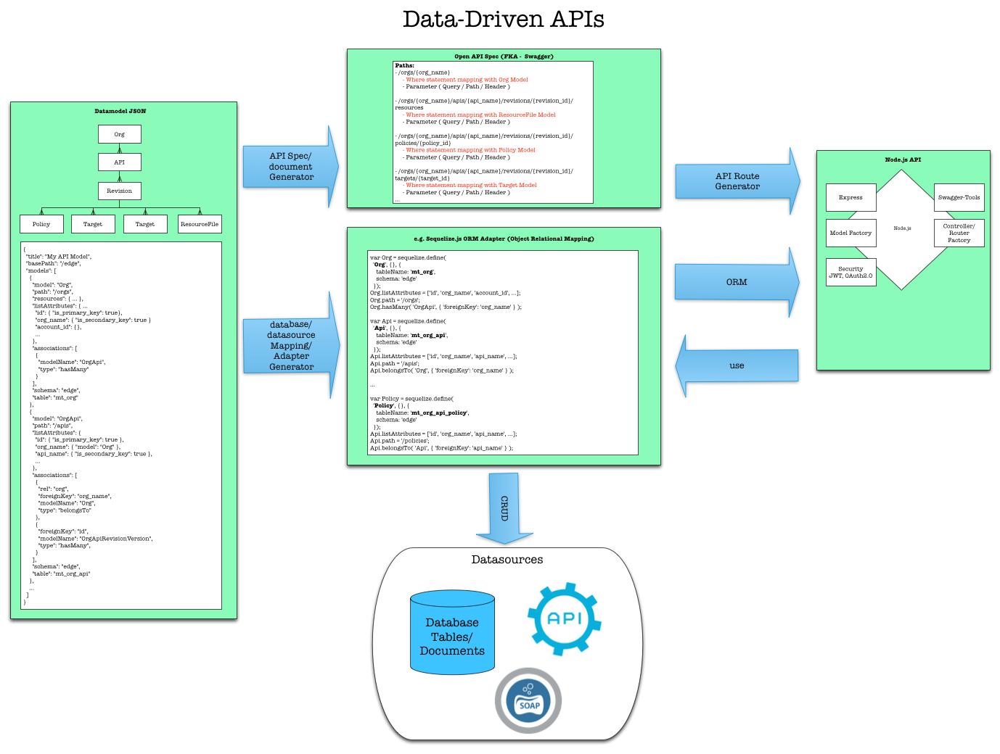

# datamodel-to-oas
Data model to Open API Specification (FKA - Swagger) generator is an NPM module that generates OAS from a data model in JSON format.

### Motivation



### Installation

```
npm install datamodel-to-oas -g
```

### Using the CLI
Using the CLI is easy:
```bash
 $ git clone git@github.com:dzuluaga/datamodel-to-oas.git
 $ cd datamodel-to-oas
 $ cd test
 $ datamodel-to-oas generate sample-data-model.json
```
That's it. You should be able to pipe the output of the generated oas file to either a file or the clipboard with pbcopy.

### Using the API
The following example can be found under test/app.js:  
```javascript
var datamodelToSwagger = require('../index');

datamodelToOas.generateOas( require('./sample-data-model.json') )
    .then( function( oasDoc ) {
      console.log( JSON.stringify( oasDoc, null, 2 ) );
    })
    .catch( function( err ) {
      console.log( err.stack );
    });
```
The Node.js module returns a promise with an Open API Specification resolving sample-data-model.json.

### Feedback and pull requests

Feel free to open an issue to submit feedback or a pull request to incorporate features into the main branch.